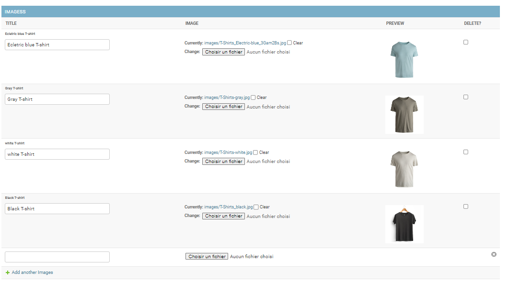

# E-Commerce_Django

## 1 Django Installation Structure Introduction

### database UML

### Template implementation

Web Template of this prpoject: https://colorlib.com/wp/template/e-shop/

## 2 Products

### database model admin relation category and product image upload

### Implemet Richtext Editor Ckeditor

### Product Image gallery

### Variants de Product

### Page Product detail with image gallery

### Product Review Comment Rating

## 3 Pages de contact

## 4 Pages Search Products

## 5 Pages login

## 6 Pages sign Up

## 7 Pages FAQ

## 8 Category Tree Subcategory menu('mptt')

## 9 Shop cart Add list delete items

### Order Prudacts and Detail

## 10 user profile information

### Update Change User & Profile Information

### Change User Password

## 11 Product Attributes Variants Amazon style Size Color

Product Attributes Variants Amazon style Size Color (Database Model and Admin)

<ol>
    <li>Create Models</li>
        Color,
        Size,
        Variants
    <li>Add variant filed to Product</li>
        variant (Noe, Size-Color, Size, Color)
    <li>Install image thumbnails</li>
        pip install django-admin-thumbnails
        Define thumbnails variants images
    <li>Product Detail</li>
        Change product detail function  -views
        Change product link depending on variant --templates
        Add variants on product detail --templates
        Apply Ajax for getting Product variant --templates
        Add ajax function  -- View
        Select Variant Size, Color -templates
</ol>

## 12 Multi Language on Database Models and Multi Currency

This part Include Setting, Category, Product, FAQ, Userprofile Model and Admin, At the frontpages Product Detail, FAQ, Userprofile

# Espace administrateur E-Commerce_Django

#### Before running this project you need intall below list apps and packages

Install Python 3.7 or above -> https://www.python.org/

Install Pip -> python get-pip.py

pip install Django

pip install django-admin-thumbnails

pip install django-ckeditor

pip install django-currencies

pip install django-mptt

pip install Pillow

#### For running

python manage.py runserver
